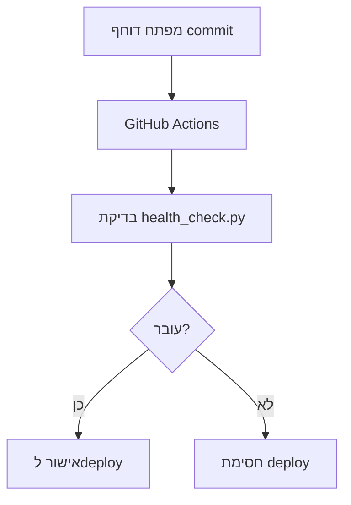
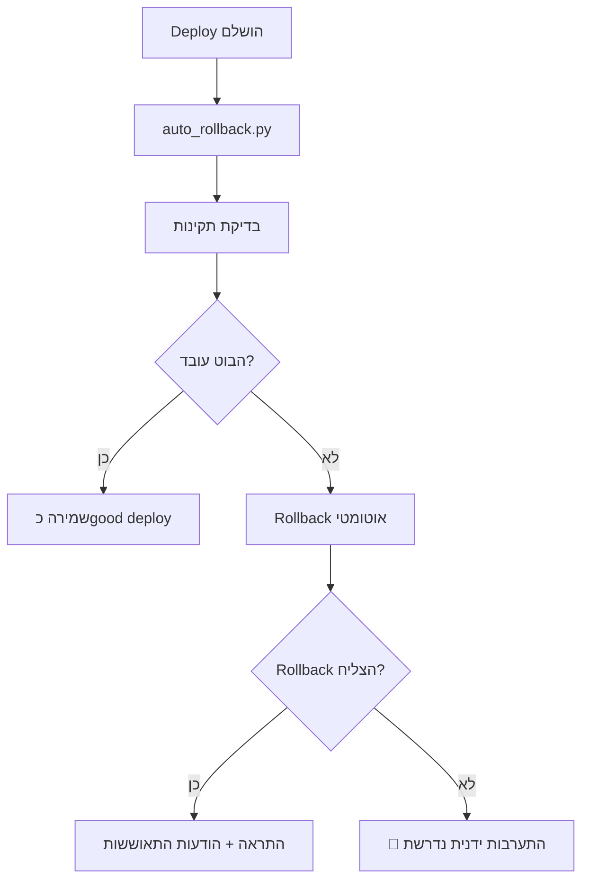

# 🚨 מנגנון בטיחות מלא לפריסות - עדכון 2024

## ⚡ סקירה מהירה

**🎯 המטרה:** להבטיח שהבוט **לעולם לא יפסיק לעבוד** בגלל פריסה שגויה.

**🛡️ כמה שכבות הגנה:**
1. **בדיקה לפני deploy** - מונע פריסות שגויות
2. **בדיקה אחרי deploy** - זיהוי מהיר של בעיות  
3. **Rollback אוטומטי** - חזרה לגרסה קודמת אם יש בעיה
4. **הודעות התאוששות משופרות** - כל משתמש מקבל הודעה כשהבוט חוזר

## 🚨 **תיקון קריטי בוצע - 02/07/2025**

**❌ הבעיה שהייתה:**
- מערכת rollback מושלמת הייתה קיימת אבל **לא מופעלת בפועל**
- הבוט רץ ישירות עם `python main.py` בלי בדיקת post-deploy
- כתוצאה: השגיאה "object dict can't be used in 'await' expression" גרמה לקריסה בלי rollback

**✅ התיקון שבוצע:**
- נוסף קוד ב-`main.py` שמזהה deploy חדש ומריץ `auto_rollback.py` אוטומטית
- המערכת עכשיו **עובדת בפועל** בסביבת הייצור
- אין צורך לשנות start commands או build scripts

**🔧 איך זה עובד עכשיו:**
1. כשהבוט מופעל ב-Render/Railway, הוא מזהה אם זה deploy חדש
2. אם כן - מריץ בדיקת `auto_rollback.py` אוטומטית
3. אם הבדיקה עוברת - ממשיך עם הבוט הרגיל
4. אם הבדיקה נכשלת - מבצע rollback ויוצא

**⚠️ זה אומר שהתיקון הנוכחי עצמו יעבור בדיקת post-deploy כשיועלה!**

---

## 🚀 שימוש מהיר

### ✅ לפני כל deploy:
```bash
python3 health_check.py
```

### ✅ אחרי כל deploy:
```bash  
python3 auto_rollback.py
```

**📊 תוצאות אפשריות:**
- **Exit 0**: הכל מושלם ✅
- **Exit 1**: הייתה בעיה אבל rollback הצליח ✅  
- **Exit 2**: בעיה חמורה - דרוש טיפול ידני! 🚨

---

## 🔍 מה קורה במנגנון החדש?

### 🔄 Pre-Deploy (לפני)


### 🔄 Post-Deploy (אחרי) 


---

## 🛠️ הגדרת הסביבה

### בסביבת Render:
1. **הוסף משתני סביבה:**
   ```
   TELEGRAM_BOT_TOKEN=your_token
   ADMIN_BOT_TELEGRAM_TOKEN=your_admin_token  
   ADMIN_NOTIFICATION_CHAT_ID=your_chat_id
   ```

2. **הוסף לbuild command:**
   ```bash
   pip install -r requirements.txt && python3 health_check.py
   ```

3. **הוסף לstart command:**
   ```bash
   python3 auto_rollback.py && python3 main.py
   ```

### בסביבה מקומית:
```bash
# בדיקה לפני deploy
python3 health_check.py

# deploy (לפי הפלטפורמה שלך)
git push origin main

# בדיקה אחרי deploy  
python3 auto_rollback.py
```

---

## 🔧 תיקונים שבוצעו

### 🐛 בעיה שתוקנה:
```
🚨 שגיאה קריטית בבוט:
object dict can't be used in 'await' expression
משתמש: 179392777
הודעה: סיימתי את פרק 2
```

### ✅ התיקון:
1. **תוקן הקוד ב-concurrent_monitor.py**
2. **נוסף מנגנון rollback אוטומטי**  
3. **חוזק מנגנון הודעות התאוששות**

### 🛡️ הגנות נוספות:
- רישום משתמשים לרשימת התאוששות גם בשגיאות שלא מטופלות
- בדיקות תקינות לפני ואחרי כל deploy
- rollback אוטומטי עם התראות מיידיות

---

## 📊 פרטי המנגנון החדש

### auto_rollback.py מבצע:

**🔍 בדיקות תקינות:**
1. `health_check.py` - בדיקת syntax ו-imports
2. בדיקת בוט חי - שליחת הודעת בדיקה לאדמין
3. בדיקת זמני תגובה

**🔄 Rollback אוטומטי:**
1. זיהוי הcommit האחרון שעבד
2. git reset לcommit הקודם
3. יצירת commit חדש עם המצב הקודם
4. התראה מיידית לאדמין

**📱 הודעות התאוששות:**
1. זיהוי כל משתמש שנפגע מהשגיאה
2. שליחת הודעה אישית לכל אחד
3. עדכון סטטוס התאוששות

---

## 🎯 דוגמאות לתרחישים

### ✅ תרחיש מוצלח:
```
🚨 מתחיל בדיקת תקינות פוסט-deploy
🔍 מתחיל בדיקת תקינות של הבוט...
✅ בדיקת תקינות עברה - הבוט תקין!
✅ בדיקת בוט חי - עברה בהצלחה!
🎉 Deploy מאומת בהצלחה! הבוט עובד תקין!
✅ Saved successful deploy: abc1234
```

### 🔄 תרחיש עם rollback:
```
🚨 מתחיל בדיקת תקינות פוסט-deploy
❌ בדיקת תקינות בסיסית נכשלה!
🚨 מפעיל ROLLBACK! סיבה: Basic health check failed
🔄 מחזיר לcommit תקין: def5678
✅ Rollback בוצע בהצלחה!
📱 התראת חירום נשלחה: ROLLBACK הושלם בהצלחה!
✅ Rollback הצליח - הבוט אמור לחזור לעבוד
```

### 🚨 תרחיש קריטי:
```
🚨 מתחיל בדיקת תקינות פוסט-deploy
❌ בדיקת בוט חי נכשלה!
🚨 מפעיל ROLLBACK! סיבה: Live bot test failed
❌ Git rollback נכשל: Repository not found
💥 CRITICAL: Rollback נכשל! נדרשת התערבות ידנית!
📱 התראת חירום נשלחה: ROLLBACK נכשל! נדרשת התערבות ידנית מיידית!
```

---

## 📈 ניטור ובקרה

### קבצי מעקב:
- `data/last_good_commit.json` - הcommit האחרון שעבד
- `data/rollback_history.json` - היסטוריית rollbacks  
- `data/critical_error_users.json` - משתמשים להתאוששות

### התראות שתקבל:
- 🚨 **הצלחת deploy** - הכל עובד 
- 🔄 **Rollback מופעל** - בעיה זוהתה
- ✅ **Rollback הצליח** - חזרנו למצב טוב
- 💥 **התערבות נדרשת** - rollback נכשל

### פקודות בדיקה:
```bash
# בדיקת סטטוס נוכחי
python3 -c "from auto_rollback import RollbackManager; print(RollbackManager().get_last_known_good_commit())"

# בדיקה ידנית מהירה  
python3 health_check.py && echo "✅ הכל תקין"

# בדיקה מלאה עם rollback אם צריך
python3 auto_rollback.py
```

---

## ⚠️ אזהרות חשובות

### 🔴 אל תעקוף את הבדיקות!
- הן שם כדי להגן על המשתמשים שלך
- כל עקיפה עלולה לגרום לנזק חמור

### 🔴 התערבות ידנית נדרשת כאשר:
- Exit code 2 מ-auto_rollback.py
- הודעת "ROLLBACK נכשל" מהאדמין בוט
- הבוט לא מגיב לבדיקות תקינות

### 🔴 בחירום - rollback ידני:
```bash
# בדוק איזה commit עבד לאחרונה
cat data/last_good_commit.json

# חזור אליו ידנית
git reset --hard <COMMIT_HASH>
git push -f origin main
```

---

## 🎊 סיכום

עכשיו יש לך:
- ✅ **הגנה מלאה מפני פריסות שגויות**
- ✅ **Rollback אוטומטי אם יש בעיה**  
- ✅ **הודעות התאוששות לכל משתמש שנפגע**
- ✅ **ניטור ובקרה מלאים**

**המטרה הושגה: הבוט לא יפסיק לעבוד! 🎯**

---

*💡 זכור: הבטיחות של המשתמשים שלך עדיפה על פיצ'רים חדשים. השתמש במנגנון הזה בכל deploy!*