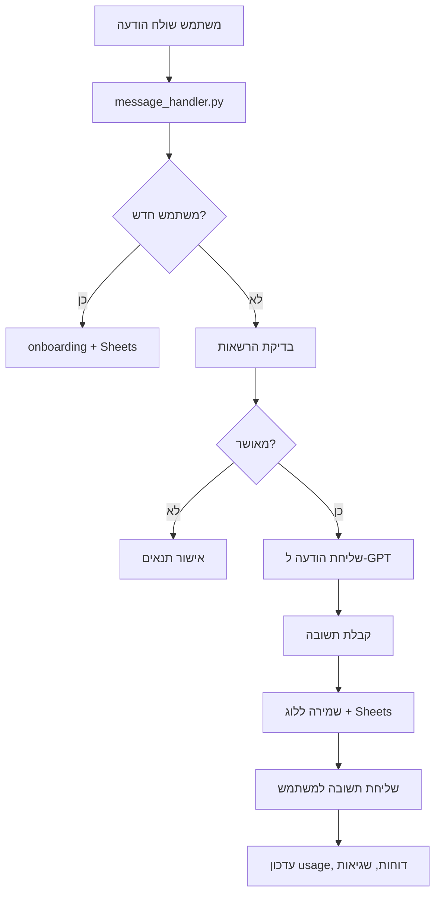

# Telegram GPT Bot — Daniel

בוט טלגרם חכם מבוסס GPT-4o, עם ניהול משתמשים, לוגים, Google Sheets, דוחות אוטומטיים, והרשאות מתקדמות.

---

## 🚀 תכונות עיקריות
- מענה חכם בעברית (GPT-4o)
- ניהול משתמשים והרשאות בגיליונות Google Sheets
- לוגים מלאים לכל הודעה, כולל usage, עלויות, שגיאות
- דוחות usage ודוחות שגיאות אוטומטיים לאדמין
- מערכת הרשאות קשיחה (אדמין בלבד לפקודות רגישות)
- קוד מסודר, הודעות מרוכזות, שדות מרוכזים, דוקומנטציה מלאה

---

## 📦 התקנה
1. **שכפול הריפו**
2. **התקנת תלויות**
   ```bash
   pip install -r requirements.txt
   ```
3. **הגדרת קובץ קונפיגורציה**
   - ערוך את `etc/secrets/config.json` לפי הדוגמה למטה.
4. **הפעלת הבוט**
   ```bash
   python main.py
   ```

---

## ⚙️ דוגמת קובץ config.json
```json
{
  "TELEGRAM_BOT_TOKEN": "<הכנס כאן את הטוקן שלך>",
  "OPENAI_API_KEY": "<הכנס כאן את ה-API KEY שלך>",
  "GOOGLE_SHEET_ID": "<מזהה הגיליון שלך>",
  "SERVICE_ACCOUNT_DICT": { ... },
  "ADMIN_BOT_TELEGRAM_TOKEN": "<טוקן בוט אדמין (רשות)>",
  "SHEET_USER_TAB": "גיליון1"
}
```

---

## 🗂️ מבנה הקוד
- `main.py` — נקודת כניסה, FastAPI webhook
- `bot_setup.py` — אתחול הבוט, תזמון דוחות
- `message_handler.py` — טיפול בכל הודעה
- `sheets_handler.py` — עבודה מול Google Sheets
- `gpt_handler.py` — אינטגרציה עם GPT
- `utils.py` — לוגים, דוחות, בדיקות תקינות
- `messages.py` — כל ההודעות הקבועות
- `fields_dict.py` — כל שמות השדות במקום אחד
- `notifications.py` — התראות לאדמין, טיפול בשגיאות
- `secret_commands.py` — פקודות סודיות לאדמין

---

## 🧠 ניהול פרומטים (Prompts)
כל הפרומטים של הבוט (system prompt, חילוץ תעודת זהות, תמצות תשובה, מיזוג רגיש) מרוכזים בקובץ `prompts.py` בלבד. שינוי פרומט מתבצע שם, בלי לפזר טקסטים בקוד. כל פרומט מתועד בעברית עם הסבר קצר לידו.

**דוגמה לייבוא ושימוש בפרומט:**
```python
from prompts import SYSTEM_PROMPT, PROFILE_EXTRACTION_PROMPT
```

---

## 🗺️ דיאגרמת זרימה (Mermaid)


---

## 📝 דוגמת שימוש
- משתמש שולח הודעה ראשונה — עובר תהליך onboarding, נרשם בגיליון, מקבל הודעות קבלת פנים.
- משתמש שולח קוד לא תקין — מקבל הודעת שגיאה.
- כל שגיאה קריטית — נשלחת לאדמין בלבד.
- כל משתמש חדש — נשלחת התראה לאדמין בלבד.

---

## 📊 דוחות אוטומטיים
- דוח usage יומי/שבועי — נשלח אוטומטית לאדמין (מספר משתמשים, הודעות, שגיאות).
- דוח שגיאות יומי — נשלח אוטומטית לאדמין (ספירה לפי סוג שגיאה).
- ניתן להפעיל דוחות ידנית ע"י פקודות סודיות:
  - `#errors_report` — דוח שגיאות
  - `#usage_report` — דוח usage שבועי

---

## 🔒 הרשאות
- רק chat_id של האדמין יכול להפעיל פקודות סודיות (מחיקה, דוחות).
- כל פקודה סודית נבדקת מול ADMIN_NOTIFICATION_CHAT_ID.
- כל דוח usage/שגיאות נשלח רק לאדמין.

---

## 🧪 בדיקות אוטומטיות
- כל פונקציה קריטית ניתנת לבדיקה (unit test) בתיקיית `tests/`.
- להרצת כל הבדיקות:
  ```bash
  pytest
  ```

---

## 👨‍💻 תרומה/פיתוח
Pull Requests, Issues, ושאלות — תמיד יתקבלו בברכה!

---

בהצלחה! 