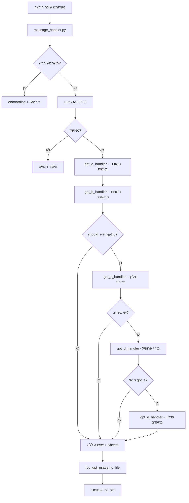

# Telegram GPT Bot — Daniel

בוט טלגרם חכם מבוסס GPT-4o, עם ניהול משתמשים, לוגים, Google Sheets, דוחות אוטומטיים, והרשאות מתקדמות.

**🔄 עדכון אחרון:** ארכיטקטורה מודולרית חדשה עם handlers נפרדים וקונפיגורציה מרכזית

---

## 🎯 מטרת הבוט

בוט טלגרם חכם שמספק **תמיכה רגשית ופסיכולוגית בעברית**. הבוט מנהל שיחות אמפתיות, עוזר למשתמשים לעבד רגשות, ומספק כלים להתמודדות עם אתגרים רגשיים.

**מה הבוט עושה:**
- מנהל שיחות תרפויטיות בעברית
- עוזר למשתמשים לעבד רגשות וטראומות
- מספק תמיכה בהתמודדות עם הומופוביה פנימית וחיצונית
- בונה פרופיל רגשי מתעדכן לכל משתמש
- שומר היסטוריית שיחות לצורך המשכיות טיפולית

**קהל היעד:** אנשים המחפשים תמיכה רגשית, במיוחד מהקהילה הלהט"בית, הזקוקים למרחב בטוח לשיחה על רגשות ואתגרים.

---

## 🚨 חשוב מאוד - שתי סביבות נפרדות!

### סביבה 1 - רנדר (ייצור):
- **הפעלה:** `python main.py`
- **לא משתמש ב-ngrok**
- **לא משתמש ב-sandbox.py**
- **רץ על פורט 8000 עם HTTP server פשוט**
- **מיועד לסביבת ייצור בלבד**

### סביבה 2 - לוקאלית (פיתוח):
- **הפעלה:** `python sandbox.py` ✅
- **משתמש ב-ngrok**
- **רץ על פורט 10000 עם uvicorn**
- **מיועד לפיתוח לוקאלי בלבד**

⚠️ **אזהרה חשובה:** אל תשנה את `main.py` כדי שיתאים לסביבה לוקאלית! הסביבה ברנדר לא אמורה לדעת בכלל על `sandbox.py`!

---

## 🚀 תכונות עיקריות
- מענה חכם בעברית (GPT-4o)
- ניהול משתמשים והרשאות בגיליונות Google Sheets
- לוגים מלאים לכל הודעה, כולל usage, עלויות, שגיאות
- דוחות usage ודוחות שגיאות אוטומטיים לאדמין
- מערכת הרשאות קשיחה (אדמין בלבד לפקודות רגישות)
- קוד מסודר, הודעות מרוכזות, שדות מרוכזים, דוקומנטציה מלאה
- **🆕 LiteLLM Integration** - ניהול עלויות מתקדם ותמיכה במודלים מרובים
- **🧠 מערכת 5 מנועי GPT מודולרית:**
  - **gpt_a** - תשובה ראשית למשתמש (GPT-4o)
  - **gpt_b** - תמצות תשובות להיסטוריה (GPT-4.1-nano)
  - **gpt_c** - חילוץ פרופיל ראשוני (GPT-4o-mini)
  - **gpt_d** - מיזוג ואיכות פרופיל (GPT-4o-mini)
  - **gpt_e** - עדכון פרופיל מתקדם (GPT-4o)

---

## 📦 התקנה והפעלה

### ⚠️ חשוב: הפעל את הבוט רק דרך sandbox.py!

📝 **הערה: מדריך זה מיועד לסביבת פיתוח לוקאלית (Cursor IDE) בלבד!**
בסביבת ייצור (production) יש להשתמש בהגדרות שרת מתאימות.

🚨 **הפעלה בסביבה לוקאלית:**
   ```bash
   python sandbox.py  ✅
   ```
   
   ❌ **אל תפעיל ישירות:**
   ```bash
   python main.py  ❌
   ```

1. **שכפול הריפו**
2. **הפעלת הבוט (הדרך הנכונה)**
   ```bash
   python sandbox.py
   ```
   
   הקובץ `sandbox.py`:
   - יוצר ומגדיר את סביבת הפיתוח (venv) אוטומטית
   - מתקין את כל התלויות הנדרשות
   - מפעיל את ngrok אוטומטית
   - מגדיר את webhook בטלגרם
   - מפעיל את הבוט עם uvicorn

3. **הגדרת קובץ קונפיגורציה**
   - ערוך את `etc/secrets/config.json` לפי הדוגמה למטה.

### ❌ אל תפעיל ישירות:
- `python main.py` - לא יעבוד כראוי
- `uvicorn main:app_fastapi` - חסר הגדרות סביבה

---

## ⚙️ דוגמת קובץ config.json
```json
{
  "TELEGRAM_BOT_TOKEN": "<הכנס כאן את הטוקן שלך>",
  "OPENAI_API_KEY": "<הכנס כאן את ה-API KEY שלך>",
  "GOOGLE_SHEET_ID": "<מזהה הגיליון שלך>",
  "SERVICE_ACCOUNT_DICT": { ... },
  "ADMIN_BOT_TELEGRAM_TOKEN": "<טוקן בוט אדמין (רשות)>",
  "SHEET_USER_TAB": "user_profiles",
  "SHEET_LOG_TAB": "log",
  "SHEET_STATES_TAB": "user_states"
}
```

**🆕 קונפיגורציה מרכזית:**
- **שמות גיליונות:** רק ב-`config.json` - שינוי אחד משפיע על הכל
- **מודלים ופרמטרים:** רק ב-`config.py` - Single Source of Truth
- **שער דולר:** רק ב-`gpt_utils.py` - עדכון אוטומטי בכל מקום

---

## 🗂️ מבנה הקוד

### 📁 **קבצים עיקריים:**
- `main.py` — נקודת כניסה, FastAPI webhook
- `bot_setup.py` — אתחול הבוט, תזמון דוחות
- `message_handler.py` — טיפול בכל הודעה
- `sheets_handler.py` — עבודה מול Google Sheets
- `config.py` — הגדרות מרכזיות, מודלים ופרמטרים
- `utils.py` — לוגים, דוחות, בדיקות תקינות
- `messages.py` — כל ההודעות הקבועות
- `fields_dict.py` — כל שמות השדות במקום אחד
- `notifications.py` — התראות לאדמין, טיפול בשגיאות
- `secret_commands.py` — פקודות סודיות לאדמין
- `daily_summary.py` — דוחות יומיים

### 🧠 **מנועי GPT (Handlers):**
- `gpt_a_handler.py` — מנוע ראשי לתשובות איכותיות
- `gpt_b_handler.py` — מנוע תמצות להיסטוריה
- `gpt_c_handler.py` — מנוע חילוץ פרופיל ראשוני
- `gpt_d_handler.py` — מנוע מיזוג ואיכות פרופיל
- `gpt_e_handler.py` — מנוע עדכון פרופיל מתקדם
- `gpt_utils.py` — כלים משותפים (עלויות, נורמליזציה)

### 📁 **תיקיות נוספות:**
- `recycle_bin/` — קבצים זמניים מהמיגרציה (לא עולה ל-GitHub)
- `tests/` — בדיקות אוטומטיות
- `data/` — נתונים ולוגים

---

## 🔄 ארכיטקטורה מודולרית חדשה

המערכת עברה רפקטורינג מלא לארכיטקטורה מודולרית:

### **עקרונות העיצוב:**
- **Single Source of Truth** - כל נתון מוגדר במקום אחד בלבד
- **DRY (Don't Repeat Yourself)** - אין שכפול של קוד או הגדרות
- **קונפיגורציה מרכזית** - כל שינוי במקום אחד משפיע על הכל
- **מודולריות** - כל מנוע GPT בקובץ נפרד עם אחריות ברורה

### **מה השתנה:**
- **לפני:** קובץ `gpt_handler.py` ענק אחד
- **אחרי:** 5 handlers נפרדים עם אחריות ברורה
- **לפני:** מודלים ופרמטרים פזורים בקוד
- **אחרי:** הכל ב-`config.py` במקום אחד
- **לפני:** שמות גיליונות קשיחים בקוד
- **אחרי:** הכל ב-`config.json` במקום אחד

### **יתרונות:**
- **תחזוקה קלה** - שינוי אחד במקום אחד
- **קריאות משופרת** - כל handler עם תפקיד ברור
- **בדיקות נקודתיות** - ניתן לבדוק כל מנוע בנפרד
- **גמישות** - קל להוסיף/לשנות מנועים

---

## 🧠 ניהול פרומטים (Prompts)
כל הפרומטים של הבוט מרוכזים בקובץ `prompts.py` בלבד:

### **פרומטים עיקריים:**
- **`SYSTEM_PROMPT`** (gpt_a) - פרומט ראשי לשיחה עם המשתמש
- **`BOT_REPLY_SUMMARY_PROMPT`** (gpt_b) - תמצות תשובת הבוט להיסטוריה
- **`PROFILE_EXTRACTION_ENHANCED_PROMPT`** (gpt_c/gpt_e) - חילוץ ועדכון פרופיל
- **`PROFILE_MERGE_PROMPT`** (gpt_d) - מיזוג ואיכות פרופיל

### **לוגיקת ההפעלה:**
- **gpt_a:** בכל הודעה מהמשתמש
- **gpt_b:** אחרי כל תשובה של הבוט
- **gpt_c:** על הודעות לא-טריוויאליות (negative logic)
- **gpt_d:** כשיש שינויים בפרופיל (smart merging)
- **gpt_e:** כל 50 אינטראקציות או 21+ אינטראקציות + 24 שעות

---

## 📊 מעקב אינטראקציות ועלויות

### **סנכרון מושלם:**
- **ספירת אינטראקציות = ספירת קריאות gpt_a** (אחד לאחד)
- **לוג אוטומטי ל-`gpt_usage_log.jsonl`** לכל אינטראקציה
- **דוחות יומיים מדויקים** עם סיכום עלויות
- **מעקב אחר כל מנוע GPT** בנפרד

### **מבנה נתונים:**
```json
{
  "timestamp": "2025-01-27T...",
  "interaction_id": "msg_123",
  "chat_id": "456",
  "type": "gpt_a",
  "cost_total_ils": 0.15,
  "has_gpt_b": true,
  "has_gpt_c": false,
  "has_gpt_d": false,
  "has_gpt_e": false
}
```

---

## 🗺️ דיאגרמת זרימה (Mermaid)


---

## 📝 דוגמת שימוש
- משתמש שולח הודעה ראשונה — עובר תהליך onboarding, נרשם בגיליון, מקבל הודעות קבלת פנים.
- משתמש שולח קוד לא תקין — מקבל הודעת שגיאה.
- כל שגיאה קריטית — נשלחת לאדמין בלבד.
- כל משתמש חדש — נשלחת התראה לאדמין בלבד.

---

## 📊 דוחות אוטומטיים
- דוח usage יומי/שבועי — נשלח אוטומטית לאדמין (מספר משתמשים, הודעות, שגיאות).
- דוח שגיאות יומי — נשלח אוטומטית לאדמין (ספירה לפי סוג שגיאה).
- **🆕 דוחות עלויות LiteLLM** - מעקב מדויק אחר עלויות לכל מודל
- ניתן להפעיל דוחות ידנית ע"י פקודות סודיות:
  - `#errors_report` — דוח שגיאות
  - `#usage_report` — דוח usage שבועי

---

## 🔒 הרשאות
- רק chat_id של האדמין יכול להפעיל פקודות סודיות (מחיקה, דוחות).
- כל פקודה סודית נבדקת מול ADMIN_NOTIFICATION_CHAT_ID.
- כל דוח usage/שגיאות נשלח רק לאדמין.

---

## 🧪 בדיקות אוטומטיות
- כל פונקציה קריטית ניתנת לבדיקה (unit test) בתיקיית `tests/`.
- **🆕 בדיקות LiteLLM** - וידוא תקינות המיגרציה
- להרצת כל הבדיקות:
  ```bash
  pytest
  ```

---

## 👨‍💻 תרומה/פיתוח
Pull Requests, Issues, ושאלות — תמיד יתקבלו בברכה!

**📋 לפני תרומה:**
- וודא שכל הבדיקות עוברות
- בדוק תאימות עם LiteLLM
- עדכן דוקומנטציה אם נדרש

---

בהצלחה! 