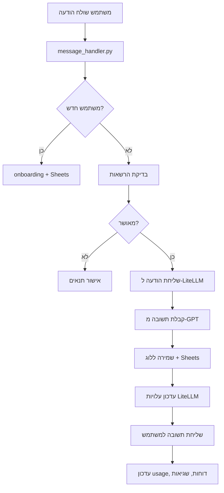

# Telegram GPT Bot — Daniel

בוט טלגרם חכם מבוסס GPT-4o, עם ניהול משתמשים, לוגים, Google Sheets, דוחות אוטומטיים, והרשאות מתקדמות.

**🔄 עדכון אחרון:** הועבר ל-LiteLLM לניהול עלויות משופר ותמיכה במודלים מרובים

---

## 🎯 מטרת הבוט

בוט טלגרם חכם שמספק **תמיכה רגשית ופסיכולוגית בעברית**. הבוט מנהל שיחות אמפתיות, עוזר למשתמשים לעבד רגשות, ומספק כלים להתמודדות עם אתגרים רגשיים.

**מה הבוט עושה:**
- מנהל שיחות תרפויטיות בעברית
- עוזר למשתמשים לעבד רגשות וטראומות
- מספק תמיכה בהתמודדות עם הומופוביה פנימית וחיצונית
- בונה פרופיל רגשי מתעדכן לכל משתמש
- שומר היסטוריית שיחות לצורך המשכיות טיפולית

**קהל היעד:** אנשים המחפשים תמיכה רגשית, במיוחד מהקהילה הלהט"בית, הזקוקים למרחב בטוח לשיחה על רגשות ואתגרים.

---

## 🚨 חשוב מאוד - שתי סביבות נפרדות!

### סביבה 1 - רנדר (ייצור):
- **הפעלה:** `python main.py`
- **לא משתמש ב-ngrok**
- **לא משתמש ב-sandbox.py**
- **רץ על פורט 8000 עם HTTP server פשוט**
- **מיועד לסביבת ייצור בלבד**

### סביבה 2 - לוקאלית (פיתוח):
- **הפעלה:** `python sandbox.py` ✅
- **משתמש ב-ngrok**
- **רץ על פורט 10000 עם uvicorn**
- **מיועד לפיתוח לוקאלי בלבד**

⚠️ **אזהרה חשובה:** אל תשנה את `main.py` כדי שיתאים לסביבה לוקאלית! הסביבה ברנדר לא אמורה לדעת בכלל על `sandbox.py`!

---

## 🚀 תכונות עיקריות
- מענה חכם בעברית (GPT-4o)
- ניהול משתמשים והרשאות בגיליונות Google Sheets
- לוגים מלאים לכל הודעה, כולל usage, עלויות, שגיאות
- דוחות usage ודוחות שגיאות אוטומטיים לאדמין
- מערכת הרשאות קשיחה (אדמין בלבד לפקודות רגישות)
- קוד מסודר, הודעות מרוכזות, שדות מרוכזים, דוקומנטציה מלאה
- **🆕 LiteLLM Integration** - ניהול עלויות מתקדם ותמיכה במודלים מרובים

---

## 📦 התקנה והפעלה

### ⚠️ חשוב: הפעל את הבוט רק דרך sandbox.py!

📝 **הערה: מדריך זה מיועד לסביבת פיתוח לוקאלית (Cursor IDE) בלבד!**
בסביבת ייצור (production) יש להשתמש בהגדרות שרת מתאימות.

🚨 **הפעלה בסביבה לוקאלית:**
   ```bash
   python sandbox.py  ✅
   ```
   
   ❌ **אל תפעיל ישירות:**
   ```bash
   python main.py  ❌
   ```

1. **שכפול הריפו**
2. **הפעלת הבוט (הדרך הנכונה)**
   ```bash
   python sandbox.py
   ```
   
   הקובץ `sandbox.py`:
   - יוצר ומגדיר את סביבת הפיתוח (venv) אוטומטית
   - מתקין את כל התלויות הנדרשות
   - מפעיל את ngrok אוטומטית
   - מגדיר את webhook בטלגרם
   - מפעיל את הבוט עם uvicorn

3. **הגדרת קובץ קונפיגורציה**
   - ערוך את `etc/secrets/config.json` לפי הדוגמה למטה.

### ❌ אל תפעיל ישירות:
- `python main.py` - לא יעבוד כראוי
- `uvicorn main:app_fastapi` - חסר הגדרות סביבה

---

## ⚙️ דוגמת קובץ config.json
```json
{
  "TELEGRAM_BOT_TOKEN": "<הכנס כאן את הטוקן שלך>",
  "OPENAI_API_KEY": "<הכנס כאן את ה-API KEY שלך>",
  "GOOGLE_SHEET_ID": "<מזהה הגיליון שלך>",
  "SERVICE_ACCOUNT_DICT": { ... },
  "ADMIN_BOT_TELEGRAM_TOKEN": "<טוקן בוט אדמין (רשות)>",
  "SHEET_USER_TAB": "גיליון1"
}
```

**🆕 LiteLLM Configuration:**
המערכת משתמשת ב-LiteLLM לניהול מודלים ועלויות. המודל המוגדר כברירת מחדל הוא `gpt-4o`. ניתן לשנות מודל בקובץ `config.py`.

---

## 🗂️ מבנה הקוד
- `main.py` — נקודת כניסה, FastAPI webhook
- `bot_setup.py` — אתחול הבוט, תזמון דוחות
- `message_handler.py` — טיפול בכל הודעה
- `sheets_handler.py` — עבודה מול Google Sheets
- `gpt_handler.py` — אינטגרציה עם GPT (עדכון ל-LiteLLM)
- `config.py` — הגדרות LiteLLM ומודלים
- `utils.py` — לוגים, דוחות, בדיקות תקינות
- `messages.py` — כל ההודעות הקבועות
- `fields_dict.py` — כל שמות השדות במקום אחד
- `notifications.py` — התראות לאדמין, טיפול בשגיאות
- `secret_commands.py` — פקודות סודיות לאדמין
- `daily_summary.py` — דוחות יומיים (משתמש ב-LiteLLM cost tracking)

**📁 תיקיות נוספות:**
- `recycle_bin/` — קבצים זמניים מהמיגרציה (לא עולה ל-GitHub)
- `tests/` — בדיקות אוטומטיות
- `data/` — נתונים ולוגים

---

## 🔄 מיגרציה ל-LiteLLM

המערכת הועברה מ-OpenAI API ישיר ל-LiteLLM כדי לספק:
- **ניהול עלויות מתקדם** - מעקב מדויק אחר עלויות לכל מודל
- **תמיכה במודלים מרובים** - אפשרות קלה להחלפת מודלים
- **לוגים משופרים** - מעקב מפורט אחר usage ועלויות
- **גמישות** - תמיכה בפרובידרים שונים

**קבצים שעודכנו:**
- `config.py` - הוספת LiteLLM wrapper
- `gpt_handler.py` - שימוש ב-LiteLLM במקום OpenAI ישיר
- `daily_summary.py` - עדכון לשימוש במערכת העלויות החדשה
- `requirements.txt` - הוספת LiteLLM dependency

**קבצים שהוסרו:**
- `gpt_pricing.json` - הועבר ל-recycle_bin (LiteLLM מטפל בעלויות)
- `gpt_usage_manager.py` - הועבר ל-recycle_bin (LiteLLM מספק מעקב מובנה)

---

## 🧠 ניהול פרומטים (Prompts)
כל הפרומטים של הבוט מרוכזים בקובץ `prompts.py` בלבד. המערכת כוללת 3 פרומטים עיקריים:
- **SYSTEM_PROMPT** (GPT-A) — פרומט ראשי לשיחה עם המשתמש
- **BOT_REPLY_SUMMARY_PROMPT** (GPT-B) — תמצות תשובת הבוט להיסטוריה
- **PROFILE_EXTRACTION_ENHANCED_PROMPT** (gpt_c) — חילוץ ועדכון פרופיל משתמש

שינוי פרומט מתבצע שם, בלי לפזר טקסטים בקוד. כל פרומט מתועד בעברית עם הסבר קצר לידו.

**דוגמה לייבוא ושימוש בפרומט:**
```python
from prompts import SYSTEM_PROMPT
```

---

## 🗺️ דיאגרמת זרימה (Mermaid)


---

## 📝 דוגמת שימוש
- משתמש שולח הודעה ראשונה — עובר תהליך onboarding, נרשם בגיליון, מקבל הודעות קבלת פנים.
- משתמש שולח קוד לא תקין — מקבל הודעת שגיאה.
- כל שגיאה קריטית — נשלחת לאדמין בלבד.
- כל משתמש חדש — נשלחת התראה לאדמין בלבד.

---

## 📊 דוחות אוטומטיים
- דוח usage יומי/שבועי — נשלח אוטומטית לאדמין (מספר משתמשים, הודעות, שגיאות).
- דוח שגיאות יומי — נשלח אוטומטית לאדמין (ספירה לפי סוג שגיאה).
- **🆕 דוחות עלויות LiteLLM** - מעקב מדויק אחר עלויות לכל מודל
- ניתן להפעיל דוחות ידנית ע"י פקודות סודיות:
  - `#errors_report` — דוח שגיאות
  - `#usage_report` — דוח usage שבועי

---

## 🔒 הרשאות
- רק chat_id של האדמין יכול להפעיל פקודות סודיות (מחיקה, דוחות).
- כל פקודה סודית נבדקת מול ADMIN_NOTIFICATION_CHAT_ID.
- כל דוח usage/שגיאות נשלח רק לאדמין.

---

## 🧪 בדיקות אוטומטיות
- כל פונקציה קריטית ניתנת לבדיקה (unit test) בתיקיית `tests/`.
- **🆕 בדיקות LiteLLM** - וידוא תקינות המיגרציה
- להרצת כל הבדיקות:
  ```bash
  pytest
  ```

---

## 👨‍💻 תרומה/פיתוח
Pull Requests, Issues, ושאלות — תמיד יתקבלו בברכה!

**📋 לפני תרומה:**
- וודא שכל הבדיקות עוברות
- בדוק תאימות עם LiteLLM
- עדכן דוקומנטציה אם נדרש

---

בהצלחה! 